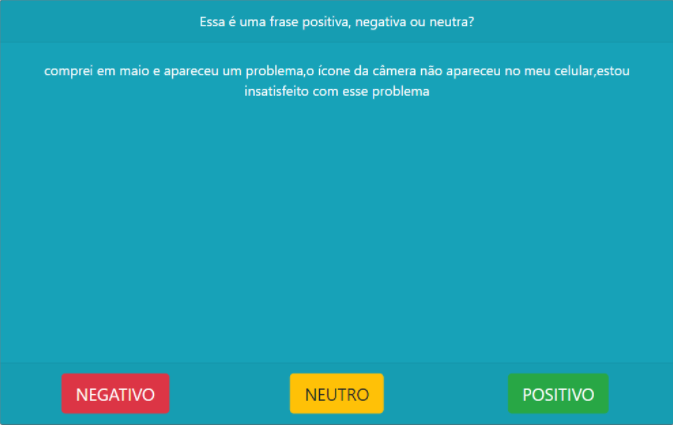
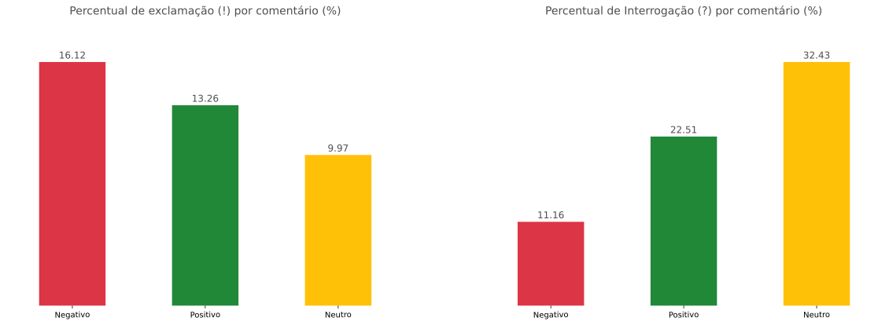
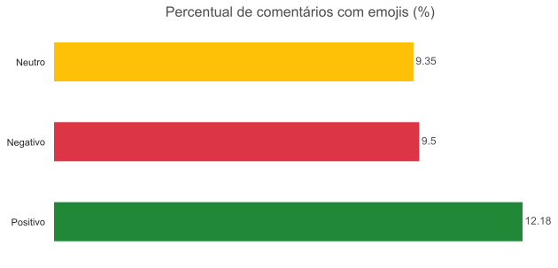
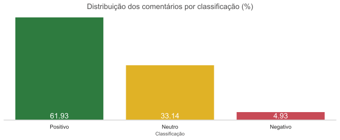
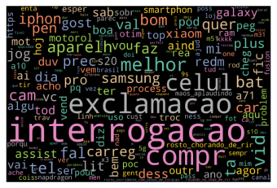
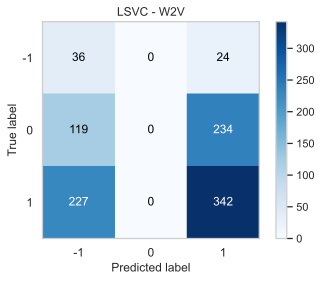
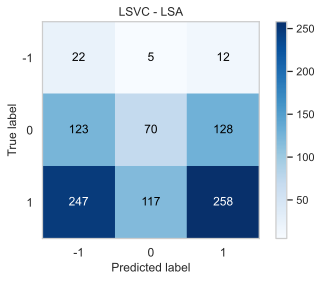
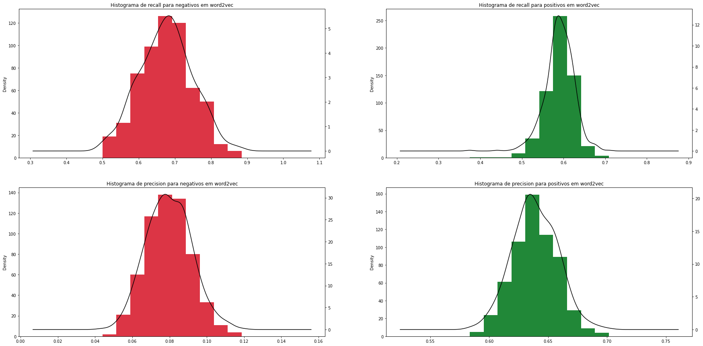

# Sentiment Analysis - Comments on Cell Phone Reviews on YouTube

# 1 Problem Statement

Noticing the volume of electronic cell phone reviews on YouTube and the popularity of their comments, I saw the potential to categorize these video comments in order to gauge public reception of the cell phones. This approach aims to capture the popular sentiment about these devices.

Thus, the goal of the model is to identify which comments are negative and positive in the cell phone reviews, that is, its recall value for negative and positive comments.

The main challenge in this process is how to categorize the primary data set for training my model. Comments on YouTube videos only have a “like” option, which does not indicate whether the comment is positive or negative, only if it was accepted by the majority or not. Some attempts to use APIs to define this base, such as Google Natural Language API, have been made, but with very unsatisfactory results.

The notebook with the complete analysis can be found at [youtube-comments-types-analysis-complete-review.ipynb](https://github.com/ErycM/electronics-sentiment-analysis-on-youtube-comments/blob/main/youtube-comments-types-analysis-complete-review.ipynb).

# 2 Data Collection

## 2.1 Survey of Electronic Products

A total of 26 cell phones were selected for analysis based on the most popular releases from 2020 and 2021, considering their price ranges. I collected a total of 10,000 comments for the database.

<table border="1" class="dataframe">
  <thead>
    <tr style="text-align: right;">
      <th></th>
      <th>Cell Phone</th>
      <th>Price Range up to</th>
    </tr>
  </thead>
  <tbody>
    <tr>
      <th>0</th>
      <td>Samsung Galaxy A10s</td>
      <td>1000</td>
    </tr>
    <tr>
      <th>1</th>
      <td>Moto E7</td>
      <td>1000</td>
    </tr>
    <tr>
      <th>2</th>
      <td>LG K22</td>
      <td>1000</td>
    </tr>
    <tr>
      <th>3</th>
      <td>Xiaomi Redmi 9</td>
      <td>1000</td>
    </tr>
    <tr>
      <th>4</th>
      <td>Philco Hit Max</td>
      <td>1000</td>
    </tr>
    <tr>
      <th>5</th>
      <td>Motorola Moto G9 Power</td>
      <td>2000</td>
    </tr>
    <tr>
      <th>6</th>
      <td>Samsung Galaxy M31</td>
      <td>2000</td>
    </tr>
    <tr>
      <th>7</th>
      <td>Motorola One Fusion Plus</td>
      <td>2000</td>
    </tr>
    <tr>
      <th>8</th>
      <td>Samsung Galaxy A71</td>
      <td>2000</td>
    </tr>
    <tr>
      <th>9</th>
      <td>Poco X3 NFC</td>
      <td>2000</td>
    </tr>
    <tr>
      <th>10</th>
      <td>Redmi Note 9S</td>
      <td>2000</td>
    </tr>
    <tr>
      <th>11</th>
      <td>Samsung Galaxy M51</td>
      <td>2500</td>
    </tr>
    <tr>
      <th>12</th>
      <td>Samsung Galaxy Note 10 Lite</td>
      <td>2500</td>
    </tr>
    <tr>
      <th>13</th>
      <td>Xiaomi Mi 10 Lite 5G</td>
      <td>2500</td>
    </tr>
    <tr>
      <th>14</th>
      <td>LG Velvet</td>
      <td>2500</td>
    </tr>
    <tr>
      <th>15</th>
      <td>iPhone SE</td>
      <td>2500</td>
    </tr>
    <tr>
      <th>16</th>
      <td>Samsung Galaxy Note 10</td>
      <td>3000</td>
    </tr>
    <tr>
      <th>17</th>
      <td>Samsung Galaxy S20</td>
      <td>3000</td>
    </tr>
    <tr>
      <th>18</th>
      <td>Galaxy S20 FE</td>
      <td>3000</td>
    </tr>
    <tr>
      <th>19</th>
      <td>Xiaomi Mi 10T Lite</td>
      <td>3000</td>
    </tr>
    <tr>
      <th>20</th>
      <td>Motorola Edge/Edge+</td>
      <td>3000+</td>
    </tr>
    <tr>
      <th>21</th>
      <td>iPhone 12</td>
      <td>3000+</td>
    </tr>
    <tr>
      <th>22</th>
      <td>ASUS ROG Phone 3</td>
      <td>3000+</td>
    </tr>
    <tr>
      <th>23</th>
      <td>Galaxy S21 Ultra</td>
      <td>3000+</td>
    </tr>
    <tr>
      <th>24</th>
      <td>Xiaomi Mi 10T/10T Pro</td>
      <td>3000+</td>
    </tr>
    <tr>
      <th>25</th>
      <td>Galaxy Z Fold 2</td>
      <td>3000+</td>
    </tr>
  </tbody>
</table>

## 2.2 Survey and Filter of Videos

I considered that the best way to find product reviews is by searching with the title “'brand + model' analysis” in Portuguese for videos uploaded up to 12 months ago and with at least 50,000 views. It is expected that at least 5 videos of each device will be analyzed.

## 2.3 Information Collection

As highlighted in the problem statement, we did not have an existing way to collect these already classified comments on YouTube. Therefore, a public comment classification site was created. The site can be viewed through this [link](https://comments-reviews-web-app.vercel.app/) and its repository [here](https://github.com/ErycM/comments-reviews-web-app). The system has the following interface:

The interface contains the following functional and technical requirements:

- Created in Reactjs and the data is stored via Firebase;
- The selection of comments for users was random and weighted. Where the less evaluated comments by users had a higher weight to be brought with higher probability before the more evaluated ones;

- Each user who made the assessment will be differentiated by the IP or a timestamp of the page opened at the moment in order to account for the experiment;
- A total of 10,000 comments were stored in the tool.

# 3.1 Data Preparation

After creating the site for collecting reviews, I monitored the data collected and evaluated by users. My final number of evaluated comments is shown below:

<table border="1" class="dataframe">
  <thead>
    <tr style="text-align: right;">
      <th>date</th>
      <th>evaluated comments</th>
      <th>evaluated comments %</th>
      <th>comments with 2</th>
      <th>comments with 3</th>
      <th>comments with 1</th>
      <th>comments with 4</th>
      <th>comments with 5</th>
      <th>comments with 6</th>
      <th>total evaluated comments</th>
    </tr>
  </thead>
  <tbody>
    <tr>
      <td>09/06/2021 10:36:01</td>
      <td>4908</td>
      <td>49.08</td>
      <td>1142</td>
      <td>232</td>
      <td>3491</td>
      <td>35</td>
      <td>7</td>
      <td>1</td>
      <td>6652</td>
    </tr>
  </tbody>
</table>

With the evaluated comments, I then proceeded to data collection. The details of this using the Firebase API can be found at [5.youtube-review-comment-collect.ipynb](https://github.com/ErycM/electronics-sentiment-analysis-on-youtube-comments/blob/main/src/5.youtube-review-comment-collect.ipynb). It will not be displayed here in order to condense the process.

After collecting the data from Firebase and manipulating it, the following data were collected:

<table border="1" class="dataframe">
  <thead>
    <tr style="text-align: right;">
      <th></th>
      <th>comments_id</th>
      <th>comment-date</th>
      <th>comment-author</th>
      <th>comment</th>
      <th>comment-likes</th>
      <th>video-id</th>
      <th>video-title</th>
      <th>video-date</th>
      <th>video-link</th>
      <th>video-likes</th>
      <th>video-views</th>
      <th>video-channel</th>
      <th>video-comment-count</th>
      <th>final_type</th>
    </tr>
  </thead>
  <tbody>
    <tr>
      <th>0</th>
      <td>0.UgwozCGH-HDyIES2ciF4AaABAg</td>
      <td>2020-12-20T22:44:18Z</td>
      <td>POP 0stras</td>
      <td>Uma porcaria. Comprei faz 3 meses. Muito arrep...</td>
      <td>0</td>
      <td>jSv8fxe3_KU</td>
      <td>GALAXY NOTE 10 LITE, FAZ SENTIDO COMPRAR? [Han...</td>
      <td>2020-02-19T16:00:09Z</td>
      <td>https://www.youtube.com/watch?v=jSv8fxe3_KU</td>
      <td>18773</td>
      <td>307422</td>
      <td>Canaltech</td>
      <td>1013</td>
      <td>-1</td>
    </tr>
    <tr>
      <th>1</th>
      <td>3.Ugzuo_fNCeU10B0Iqv54AaABAg</td>
      <td>2021-04-19T01:28:56Z</td>
      <td>tout a commencé en France</td>
      <td>Assistindo com o meu a51 e agora estou querend...</td>
      <td>10</td>
      <td>6LwYbm71AJM</td>
      <td>Review GALAXY S21 ULTRA! Agora sim a SAMSUNG f...</td>
      <td>2021-04-07T22:00:01Z</td>
      <td>https://www.youtube.com/watch?v=6LwYbm71AJM</td>
      <td>5287</td>
      <td>91701</td>
      <td>Be!Tech</td>
      <td>430</td>
      <td>1</td>
    </tr>
    <tr>
      <th>2</th>
      <td>4.UgzaPxJpaltmYRPm7WZ4AaABAg</td>
      <td>2021-06-03T22:58:59Z</td>
      <td>Tasio de Luanda Luanda</td>
      <td>Bom eu tenho problemas e com poeira água e queda</td>
      <td>0</td>
      <td>5JWFHfF4nGg</td>
      <td>SAMSUNG GALAXY M31 // um INTERMEDIÁRIO com 600...</td>
      <td>2020-07-09T21:19:36Z</td>
      <td>https://www.youtube.com/watch?v=5JWFHfF4nGg</td>
      <td>22040</td>
      <td>304881</td>
      <td>EscolhaSegura</td>
      <td>1413</td>
      <td>1</td>
    </tr>
    <tr>
      <th>3</th>
      <td>5.Ugxg7N1mhRETPeDd0jB4AaABAg</td>
      <td>2021-03-04T02:37:38Z</td>
      <td>ᴘ ʀ ɪ ɴ ᴄ ᴇ s ᴀッ™</td>
      <td>Se no Samsung vier os emoji do iPhone eu me re...</td>
      <td>0</td>
      <td>vOVz5rPk2vU</td>
      <td>GALAXY NOTE 10 e GALAXY NOTE 10 PLUS!</td>
      <td>2019-08-07T23:00:51Z</td>
      <td>https://www.youtube.com/watch?v=vOVz5rPk2vU</td>
      <td>196838</td>
      <td>2130935</td>
      <td>Coisa de Nerd</td>
      <td>5604</td>
      <td>0</td>
    </tr>
    <tr>
      <th>4</th>
      <td>6.Ugwxvye3XUXp-6GdwxV4AaABAg</td>
      <td>2021-03-03T20:09:55Z</td>
      <td>Eu Mesmo</td>
      <td>Smartphone gamer muito excelentente msm, mas f...</td>
      <td>0</td>
      <td>TdALKXTVZRU</td>
      <td>ROG PHONE 3: UNBOXING DO SMARTPHONE MAIS PODER...</td>
      <td>2020-07-22T15:30:08Z</td>
      <td>https://www.youtube.com/watch?v=TdALKXTVZRU</td>
      <td>62254</td>
      <td>942191</td>
      <td>Loop Infinito</td>
      <td>2266</td>
      <td>0</td>
    </tr>
    <tr>
      <th>...</th>
      <td>...</td>
      <td>...</td>
      <td>...</td>
      <td>...</td>
      <td>...</td>
      <td>...</td>
      <td>...</td>
      <td>...</td>
      <td>...</td>
      <td>...</td>
      <td>...</td>
      <td>...</td>
      <td>...</td>
      <td>...</td>
    </tr>
    <tr>
      <th>4901</th>
      <td>9990.Ugz4MHAKLSZjySMHC8p4AaABAg</td>
      <td>2020-10-22T19:19:10Z</td>
      <td>Saulo Lima</td>
      <td>Entrada em cima , n gosto ! Gosto de entrada e...</td>
      <td>0</td>
      <td>uwlW-aTc5j4</td>
      <td>MOTOROLA EDGE+! O MELHOR MOTOROLA JA FEITO! Ma...</td>
      <td>2020-07-02T11:59:43Z</td>
      <td>https://www.youtube.com/watch?v=uwlW-aTc5j4</td>
      <td>11290</td>
      <td>117110</td>
      <td>Dudu Rocha</td>
      <td>835</td>
      <td>1</td>
    </tr>
    <tr>
      <th>4902</th>
      <td>9993.Ugy9hH2G4Nq55fBuJ414AaABAg</td>
      <td>2020-12-06T20:06:26Z</td>
      <td>Andressa Tenório</td>
      <td>Sempre quis dizer isso.... assistindo do meu a...</td>
      <td>1</td>
      <td>w8ZokAmv8yE</td>
      <td>Review Samsung Galaxy A71: um celular intermed...</td>
      <td>2020-08-10T17:25:44Z</td>
      <td>https://www.youtube.com/watch?v=w8ZokAmv8yE</td>
      <td>15444</td>
      <td>257622</td>
      <td>TecMundo</td>
      <td>1155</td>
      <td>1</td>
    </tr>
    <tr>
      <th>4903</th>
      <td>9995.UgzCH5fbhBklPp22nbd4AaABAg</td>
      <td>2021-06-29T03:21:41Z</td>
      <td>XTRAJ4DO FF 🇧🇷</td>
      <td>To doido pra ganhar o meu moto g9 play</td>
      <td>0</td>
      <td>kX2xqUDqfRA</td>
      <td>Motorola Moto G9 Play vs Moto G9 Power - QUAL ...</td>
      <td>2021-02-04T14:51:00Z</td>
      <td>https://www.youtube.com/watch?v=kX2xqUDqfRA</td>
      <td>20068</td>
      <td>290832</td>
      <td>Gesiel Taveira</td>
      <td>1108</td>
      <td>1</td>
    </tr>
    <tr>
      <th>4904</th>
      <td>9997.Ugwu1TjlQHr-soAyagt4AaABAg</td>
      <td>2020-12-27T22:47:16Z</td>
      <td>Gu</td>
      <td>Mi 10t pro ou mi 10 pro?</td>
      <td>0</td>
      <td>MSqN27wR-gI</td>
      <td>MI 10T PRO: TOP de LINHA XIAOMI com PREÇO de I...</td>
      <td>2020-12-27T22:20:22Z</td>
      <td>https://www.youtube.com/watch?v=MSqN27wR-gI</td>
      <td>2286</td>
      <td>65595</td>
      <td>TudoCelular</td>
      <td>430</td>
      <td>0</td>
    </tr>
    <tr>
      <th>4905</th>
      <td>9999.UgwIP04x6RP8Op4bg3R4AaABAg</td>
      <td>2021-05-25T19:08:07Z</td>
      <td>《Rodrigues》</td>
      <td>Pena q ele ñ pode amostrar os preços!;No Googl...</td>
      <td>0</td>
      <td>efbnQ2I3zIg</td>
      <td>CHEGOU! Motorola MOTO G9 POWER com FORÇA TOTAL...</td>
      <td>2020-12-10T12:00:09Z</td>
      <td>https://www.youtube.com/watch?v=efbnQ2I3zIg</td>
      <td>34967</td>
      <td>419324</td>
      <td>Gesiel Taveira</td>
      <td>1907</td>
      <td>0</td>
    </tr>
  </tbody>
</table>

4906 rows × 14 columns

Where "final_type" corresponds to the classification of the comment as positive (1), neutral (0), or negative (-1)

# 3.2 Transformation with NLP Techniques

My goal here is to standardize my comments to apply feature creation techniques (LSA and Word2Vec). I defined functions for each of the transformation stages, which are:

- Convert all comments to lowercase;
- Remove punctuation;
- Transform emojis into codes. Example:
- Text normalization in UTF-8;
- Removal of stop words (except the word "não" [no]);
- Stemming of words. Example:
- Removal of excessive spaces (\n).

# 4 Exploratory Analysis

After processing the information, some analyses were made to understand the data.

## 4.1 Exclamation and Question Marks are Important for Analysis

It is noted that the number of comments with exclamation marks is higher for negative comments and considerably lower for neutral ones, also the percentage of question marks for neutral comments is quite high as well and very low for negative comments. Both will be considered in the model's features.

## 4.2 Emojis May Be Relevant for Analysis

<table border="1" class="dataframe">
  <thead>
    <tr style="text-align: right;">
      <th></th>
      <th>Negative</th>
      <th>Neutral</th>
      <th>Positive</th>
    </tr>
  </thead>
  <tbody>
    <tr>
      <th>0</th>
      <td>😂 9</td>
      <td>🤣 42</td>
      <td>😂 84</td>
    </tr>
    <tr>
      <th>1</th>
      <td>😭 7</td>
      <td>😂 24</td>
      <td>😍 79</td>
    </tr>
    <tr>
      <th>2</th>
      <td>🤣 6</td>
      <td>👏 23</td>
      <td>👏 75</td>
    </tr>
    <tr>
      <th>3</th>
      <td>♂️ 5</td>
      <td>🏻 16</td>
      <td>🤣 40</td>
    </tr>
    <tr>
      <th>4</th>
      <td>🤦 5</td>
      <td>👍 15</td>
      <td>😭 39</td>
    </tr>
    <tr>
      <th>5</th>
      <td>🤔 3</td>
      <td>🤔 12</td>
      <td>❤️ 32</td>
    </tr>
    <tr>
      <th>6</th>
      <td>🤦🏾 2</td>
      <td>😍 12</td>
      <td>😁 28</td>
    </tr>
    <tr>
      <th>7</th>
      <td>🏾 2</td>
      <td>😠 10</td>
      <td>🥰 26</td>
    </tr>
    <tr>
      <th>8</th>
      <td>🤷 2</td>
      <td>👎 9</td>
      <td>👍 25</td>
    </tr>
    <tr>
      <th>9</th>
      <td>😔 2</td>
      <td>😅 9</td>
      <td>🏼 23</td>
    </tr>
  </tbody>
</table>

Although the number of emojis per comment is small, the emojis among the classifications are mostly distinct and can be relevant as features.

## 4.3 Very Low Number of Negative Comments

There is a very low number of negative comments in my data scope, as well as a very large number of positive comments. Class balancing techniques will be used in this model.

# 5. Modeling

Through exploratory analysis, it is understood that the use of a data balancing method will be necessary. For this, I created a generic function that applies the oversample method to the data that will be used later.

## 5.1 Creating Features

Through some tests and analyses conducted in [6.youtube-comments-types-analysis.ipynb](https://github.com/ErycM/electronics-sentiment-analysis-on-youtube-comments/blob/main/src/6.youtube-comments-types-analysis.ipynb), it was concluded that the best feature creation methods to be used are LSA and Word2Vec, as they bring the best results when combined with oversampling. In both methods, 100 features were created for the classification of comments.

# 5.3 Training the Model

For training the model from the created features, the LinearSVC method brought the best recall results compared to other methods used in [6.youtube-comments-types-analysis.ipynb](https://github.com/ErycM/electronics-sentiment-analysis-on-youtube-comments/blob/main/src/6.youtube-comments-types-analysis.ipynb). For executing oversampling, the Adaptive Synthetic (ADASYN) method gave me the best result as it more effectively controls the replication of data in areas with higher density of my minority sample, avoiding unnecessary replications in outliers. The strategy used for creating new data with ADASYN was based on "minority", which balances only the data in smaller quantities with those in larger quantities, avoiding any alteration in the neutral category data that are not relevant for the analysis.

    SVC - Report W2V
                  precision    recall  f1-score   support
    
        Negativo       0.09      0.65      0.15        54
          Neutro       0.25      0.00      0.01       331
        Positivo       0.62      0.60      0.61       597
    
        accuracy                           0.40       982
       macro avg       0.32      0.42      0.26       982
    weighted avg       0.47      0.40      0.38       982
    
    SVC - Report LSA
                  precision    recall  f1-score   support
    
        Negativo       0.06      0.58      0.11        38
          Neutro       0.34      0.17      0.22       341
        Positivo       0.61      0.44      0.51       603
    
        accuracy                           0.35       982
       macro avg       0.33      0.40      0.28       982
    weighted avg       0.49      0.35      0.39       982
    
    

    
After performing the oversampling and training the model with LinearSVC, we obtained recall values of approximately 65% for negative and 60% for positive comments using Word2Vec. For the LSA method, we achieved a higher recall value for negatives (80%) but lower for positives (35%). However, to balance our results in both attributes, Word2Vec is more efficient.

# 5.3 Finalizing Results

To understand the concrete outcome of our model, I trained the model 600 times to obtain more precise results.

<table border="1" class="dataframe">
  <thead>
    <tr style="text-align: right;">
      <th></th>
      <th>accuracy</th>
      <th>-1.precision</th>
      <th>-1.recall</th>
      <th>-1.f1-score</th>
      <th>-1.support</th>
      <th>0.precision</th>
      <th>0.recall</th>
      <th>0.f1-score</th>
      <th>0.support</th>
      <th>1.precision</th>
      <th>...</th>
      <th>1.f1-score</th>
      <th>1.support</th>
      <th>macro avg.precision</th>
      <th>macro avg.recall</th>
      <th>macro avg.f1-score</th>
      <th>macro avg.support</th>
      <th>weighted avg.precision</th>
      <th>weighted avg.recall</th>
      <th>weighted avg.f1-score</th>
      <th>weighted avg.support</th>
    </tr>
  </thead>
  <tbody>
    <tr>
      <th>0</th>
      <td>0.429162</td>
      <td>0.087079</td>
      <td>0.704545</td>
      <td>0.155000</td>
      <td>44</td>
      <td>0.166667</td>
      <td>0.003067</td>
      <td>0.006024</td>
      <td>326</td>
      <td>0.633058</td>
      <td>...</td>
      <td>0.637271</td>
      <td>597</td>
      <td>0.295601</td>
      <td>0.449718</td>
      <td>0.266098</td>
      <td>967</td>
      <td>0.450983</td>
      <td>0.429162</td>
      <td>0.402518</td>
      <td>967</td>
    </tr>
    <tr>
      <th>1</th>
      <td>0.450879</td>
      <td>0.078550</td>
      <td>0.541667</td>
      <td>0.137203</td>
      <td>48</td>
      <td>0.285714</td>
      <td>0.006536</td>
      <td>0.012780</td>
      <td>306</td>
      <td>0.648649</td>
      <td>...</td>
      <td>0.657005</td>
      <td>613</td>
      <td>0.337638</td>
      <td>0.404594</td>
      <td>0.268996</td>
      <td>967</td>
      <td>0.505502</td>
      <td>0.450879</td>
      <td>0.427343</td>
      <td>967</td>
    </tr>
    <tr>
      <th>2</th>
      <td>0.409514</td>
      <td>0.086957</td>
      <td>0.692308</td>
      <td>0.154506</td>
      <td>52</td>
      <td>0.500000</td>
      <td>0.023333</td>
      <td>0.044586</td>
      <td>300</td>
      <td>0.654917</td>
      <td>...</td>
      <td>0.611785</td>
      <td>615</td>
      <td>0.413958</td>
      <td>0.429875</td>
      <td>0.270293</td>
      <td>967</td>
      <td>0.576314</td>
      <td>0.409514</td>
      <td>0.411229</td>
      <td>967</td>
    </tr>
    <tr>
      <th>3</th>
      <td>0.422958</td>
      <td>0.058496</td>
      <td>0.583333</td>
      <td>0.106329</td>
      <td>36</td>
      <td>0.333333</td>
      <td>0.003096</td>
      <td>0.006135</td>
      <td>323</td>
      <td>0.639669</td>
      <td>...</td>
      <td>0.638087</td>
      <td>608</td>
      <td>0.343833</td>
      <td>0.407647</td>
      <td>0.250184</td>
      <td>967</td>
      <td>0.515710</td>
      <td>0.422958</td>
      <td>0.407204</td>
      <td>967</td>
    </tr>
    <tr>
      <th>4</th>
      <td>0.418821</td>
      <td>0.065491</td>
      <td>0.666667</td>
      <td>0.119266</td>
      <td>39</td>
      <td>0.500000</td>
      <td>0.010101</td>
      <td>0.019802</td>
      <td>297</td>
      <td>0.666667</td>
      <td>...</td>
      <td>0.629289</td>
      <td>631</td>
      <td>0.410719</td>
      <td>0.424216</td>
      <td>0.256119</td>
      <td>967</td>
      <td>0.591231</td>
      <td>0.418821</td>
      <td>0.421524</td>
      <td>967</td>
    </tr>
    <tr>
      <th>...</th>
      <td>...</td>
      <td>...</td>
      <td>...</td>
      <td>...</td>
      <td>...</td>
      <td>...</td>
      <td>...</td>
      <td>...</td>
      <td>...</td>
      <td>...</td>
      <td>...</td>
      <td>...</td>
      <td>...</td>
      <td>...</td>
      <td>...</td>
      <td>...</td>
      <td>...</td>
      <td>...</td>
      <td>...</td>
      <td>...</td>
      <td>...</td>
    </tr>
    <tr>
      <th>595</th>
      <td>0.381593</td>
      <td>0.073227</td>
      <td>0.744186</td>
      <td>0.133333</td>
      <td>43</td>
      <td>0.500000</td>
      <td>0.006270</td>
      <td>0.012384</td>
      <td>319</td>
      <td>0.636882</td>
      <td>...</td>
      <td>0.592396</td>
      <td>605</td>
      <td>0.403370</td>
      <td>0.434725</td>
      <td>0.246038</td>
      <td>967</td>
      <td>0.566662</td>
      <td>0.381593</td>
      <td>0.380645</td>
      <td>967</td>
    </tr>
    <tr>
      <th>596</th>
      <td>0.422958</td>
      <td>0.089286</td>
      <td>0.673077</td>
      <td>0.157658</td>
      <td>52</td>
      <td>0.500000</td>
      <td>0.012698</td>
      <td>0.024768</td>
      <td>315</td>
      <td>0.652557</td>
      <td>...</td>
      <td>0.634105</td>
      <td>600</td>
      <td>0.413948</td>
      <td>0.434147</td>
      <td>0.272177</td>
      <td>967</td>
      <td>0.572572</td>
      <td>0.422958</td>
      <td>0.409993</td>
      <td>967</td>
    </tr>
    <tr>
      <th>597</th>
      <td>0.392968</td>
      <td>0.064039</td>
      <td>0.619048</td>
      <td>0.116071</td>
      <td>42</td>
      <td>0.000000</td>
      <td>0.000000</td>
      <td>0.000000</td>
      <td>337</td>
      <td>0.631016</td>
      <td>...</td>
      <td>0.616188</td>
      <td>588</td>
      <td>0.231685</td>
      <td>0.407029</td>
      <td>0.244086</td>
      <td>967</td>
      <td>0.386481</td>
      <td>0.392968</td>
      <td>0.379724</td>
      <td>967</td>
    </tr>
    <tr>
      <th>598</th>
      <td>0.407446</td>
      <td>0.069652</td>
      <td>0.736842</td>
      <td>0.127273</td>
      <td>38</td>
      <td>0.307692</td>
      <td>0.012945</td>
      <td>0.024845</td>
      <td>309</td>
      <td>0.655797</td>
      <td>...</td>
      <td>0.617747</td>
      <td>620</td>
      <td>0.344380</td>
      <td>0.444553</td>
      <td>0.256622</td>
      <td>967</td>
      <td>0.521528</td>
      <td>0.407446</td>
      <td>0.409014</td>
      <td>967</td>
    </tr>
    <tr>
      <th>599</th>
      <td>0.407446</td>
      <td>0.071247</td>
      <td>0.682927</td>
      <td>0.129032</td>
      <td>41</td>
      <td>0.000000</td>
      <td>0.000000</td>
      <td>0.000000</td>
      <td>320</td>
      <td>0.642105</td>
      <td>...</td>
      <td>0.622449</td>
      <td>606</td>
      <td>0.237784</td>
      <td>0.428962</td>
      <td>0.250494</td>
      <td>967</td>
      <td>0.405416</td>
      <td>0.407446</td>
      <td>0.395547</td>
      <td>967</td>
    </tr>
  </tbody>
</table>

600 rows × 21 columns

    Word2Vec Negative Recall  0.6760651665443369
    Word2Vec Positive Recall  0.5902087091180059
    Word2Vec Negative Precision  0.07972179854547427
    Word2Vec Positive Precision  0.6387797598972071
    ------------------------------------------------
    LSA Negative Recall  0.7701296959476054
    LSA Positive Recall  0.38967991422049786
    LSA Negative Precision  0.06515107584511744
    LSA Positive Precision  0.6489308944833397
    
For both features, we obtained results similar to those previously executed. Notably, our main attributes for the Word2Vec feature were 67% for negatives and 59% for positives.
    

    

